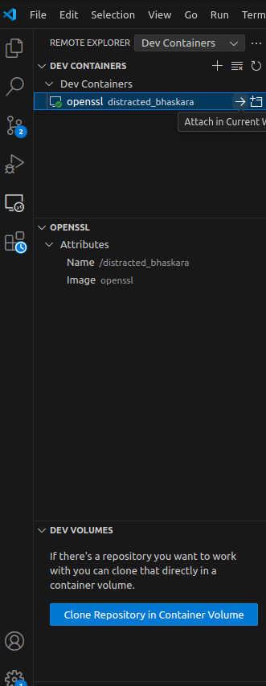

# PyAFL: When Protocol Fuzzing Meets the Power of Python

> **The "Lite Version" of AFLnet Built for Researchers — Say Goodbye to the Torment of C, Embrace the Efficiency of Python!**

## 🤔 Have You Ever Struggled Like This?

- Spent two months studying **AFLnet**, finally grasping the essence of state machines, mutation, and feedback.
- Countless innovative ideas popped into your head: **state selection algorithms**, **mutation strategies**, **power scheduling**...
- But due to unfamiliarity with C, you were forced to battle **Segment Faults**, **memory leaks**, and **pointer errors** day and night.
- Libraries taken for granted in Python like `numpy`, `pandas`, and `scikit-learn` are nowhere to be found in C.
- Spent months implementing an idea, only to find it ineffective, with **half your graduate career already past**...
- The next idea? Another few weeks or even months of development? **Time won't wait!**

## 🎯 PyAFL is Born for You!

**Yes, my friend, yes!**

**PyAFL** fully implements the core logic of AFLnet but is built in **pure Python**, allowing you to:

### ✨ Core Advantages
- 🐍 **Pure Python Implementation** - Get started directly, no need to wrestle with C.
- 🔧 **Seamless Integration with Python Ecosystem** - Plug and play with NumPy, Pandas, machine learning libraries, and more.
- ⚡ **Rapid Prototyping and Validation** - Validate ideas in days, not months.
- 🧠 **Focus on Algorithm Innovation** - Say goodbye to low-level debugging and focus on core research.
- 📊 **Rich Data Analysis** - Easily record and analyze test results, with support for Jupyter visualization.

## 🚀 Quick Start
It is recommended to use the Docker environment for a smoother and safer experience.

1.  **Environment Dependencies**

    1.1 **Install Docker**

    For Docker installation, refer to:
    [https://blog.csdn.net/2301_82242351/article/details/138561820](https://blog.csdn.net/2301_82242351/article/details/138561820) (Chinese resource)

    For Docker mirror source configuration, refer to:
    [https://blog.csdn.net/u014390502/article/details/143472743](https://blog.csdn.net/u014390502/article/details/143472743) (Chinese resource)

    Finally, run `docker run hello-world`. A successful run indicates installation is complete.

    1.2 **Install VSCode**

    Install the **Dev Containers** extension in VSCode.

2.  **OpenSSL Fuzzing Example**

    2.1 **Installation**
    bash
    git clone https://gitee.com/zhangph12138/pyafl-profuzzbench.git
    cd pyafl-profuzzbench/TLS/openssl
    docker build --progress=plain -t openssl .

    2.2 **Running**
    bash
    docker run -it openssl bash

    Open VSCode. After installing the Dev Containers extension, you will see the icon highlighted in red on the left sidebar.
    
    Click the small arrow next to the `openssl` container.
    

    **Note: You may need to run `sudo usermod -aG docker $USER` to allow your regular user account to use Docker, otherwise the container might not appear in VSCode.**

    Open the directory `/home/ubuntu/pyafl`.

    **Start Fuzzing:**
    bash
    python3 main.py ./configs/openssl.json

    **Collect Coverage Information:**
    bash
    ./cov_script.sh /home/ubuntu/experiments/out-openssl-pyafl 4433 50 /home/ubuntu/pyafl/pyafl-openssl.csv

    Coverage data will be saved to `/home/ubuntu/pyafl/pyafl-openssl.csv`.

3.  **How to Extend**

    To test other protocols:
    1.  You need to write a corresponding `config.json` file.

    json
    {
        "name": "openssl", // Name of the protocol implementation
        "protocol": "TLS", // Protocol type
        "skip_deterministic": "True", // Whether to skip deterministic mutation (can usually be left as is)
        "input_dir": "/home/ubuntu/experiments/in-tls", // Input directory (same as AFLnet)
        "extra": "/home/ubuntu/experiments/tls.dict", // Dictionary file (same as AFLnet)
        "output_dir": "/home/ubuntu/experiments/out-openssl-pyafl", // Output directory (output content differs slightly)
        "use_net": "tcp://127.0.0.1/4433", // Network target (same as AFLnet)
        "server_wait": "10000", // Server startup wait time (ms)
        "terminate_child": "True", // Whether to terminate child processes (leave unchanged if unsure)
        "poll_wait_msecs": "30", // Max wait time per polling operation (ms), i.e., max wait after sending a message
        "exec_tmout": "5000+", // Maximum execution timeout (ms)
        "mem_limit": "none", // Memory limit
        "target_cmd": "/home/ubuntu/experiments/openssl/apps/openssl s_server -key /home/ubuntu/experiments/openssl/key.pem -cert /home/ubuntu/experiments/openssl/cert.pem -4 -naccept 1 -no_anti_replay", // Command to start the server
        "dumb_mode": "False"
    }

    2.  You need to extend the protocol by implementing the corresponding parsing code. This is done in `Fuzzer.py` by adding new sections. It's straightforward – you can even use AI models to help convert AFLnet's corresponding C code to Python. (Note: Other protocols have not been tested by the author and are not implemented yet).

    python
            # Extract messages based on protocol type
            if self.config['protocol'] == "TLS":
                messages = utils.extract_requests_tls(file_content)

## 📖 Target Audience

- 🔬 **Graduate Students in Security Research** - Make research more efficient and graduation smoother.
- 🧑‍💻 **Beginners in Protocol Fuzzing** - Lower the learning barrier and speed up the onboarding process.
- 🤖 **Machine Learning Security Researchers** - Easily integrate ML models into the fuzzing pipeline.
- 🛠️ **Security Engineers Wanting to Quickly Validate Ideas** - Shorten the cycle from idea to validation.

## 💡 Why Choose PyAFL?

> "I spent two months understanding AFLnet and another three months wrestling with C.
> Finally, with PyAFL, I validated my new algorithm idea in **just one week**.
> This is the tool I needed!"

## 🌟 Project Status

- ✅ Core functionality of AFLnet fully implemented.
- ✅ TLS protocol implementation and OpenSSL case study completed.
- ✅ Extensible architecture design.
- 🚧 Development of support for more protocols ongoing.
- 🚧 Development of advanced data analysis features ongoing.

## TODO

- Implement more protocol case studies.
- Develop a more user-friendly interface.

## 🤝 Contributions and Support

**Contributions of code, ideas, and use cases are welcome!**

Whether it's submitting an Issue, creating a Pull Request, or sharing your research case study,
it is a great support to the project!

---

**⭐ If this project helps you, please give us a Star!**
**Your support is the greatest motivation for our continued development!**

---

#ProtocolFuzzing #Python #AFLnet #CyberSecurity #OpenSourceResearch #GraduationTool