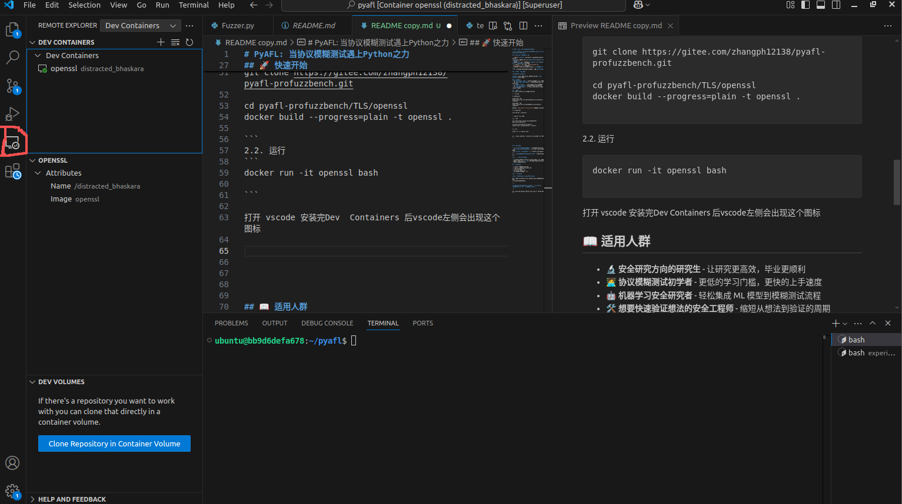
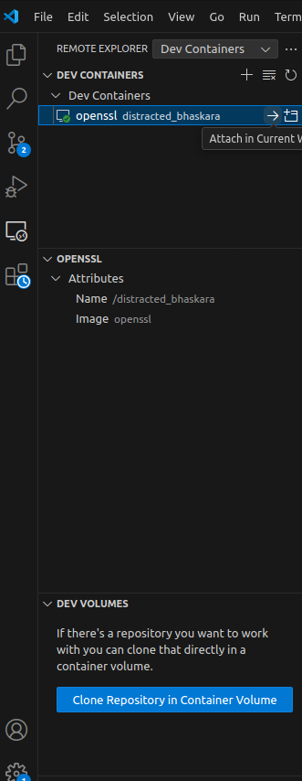

# PyAFL: 当协议模糊测试遇上Python之力

> **专为研究者打造的 AFLnet「青春版」—— 告别 C 语言的折磨，拥抱 Python 的高效！**
---

[中文文档](README-zh.md) | [English Documentation](README.md)

---

我们基于[aflnet](https://github.com/aflnet/aflnet) 开发

```
@inproceedings{AFLNet,
author={Van{-}Thuan Pham and Marcel B{\"o}hme and Abhik Roychoudhury},
title={AFLNet: A Greybox Fuzzer for Network Protocols},
booktitle={Proceedings of the 13rd IEEE International Conference on Software Testing, Verification and Validation : Testing Tools Track},
year={2020},}
```

## 🤔 你是否也曾这样挣扎过？

- 潜心研读 **AFLnet** 两个月，终于理解了状态机、变异与反馈的精髓
- 脑中迸发出无数改进灵感：**状态选择算法**、**变异策略**、**能量调度**...
- 却因不熟悉 C 语言，不得不与 **Segment Fault**、**内存泄漏** 和 **指针错误** 日夜搏斗
- 在 Python 中习以为常的 `numpy`、`pandas`、`scikit-learn` 在 C 中无处可寻
- 耗费数月实现想法，却发现效果不佳，而**研究生生涯已过半**...
- 下一个想法？又要投入数周甚至数月开发？**时间等不起！**

## 🎯 PyAFL 为你而生！

**有的！兄弟，有的！**

**PyAFL** 完整实现了 AFLnet 的核心逻辑，但用 **纯 Python** 构建，让你：

### ✨ 核心优势
- 🐍 **纯 Python 实现** - 直接上手，无需与 C 语言搏斗
- 🔧 **无缝集成 Python 生态** - NumPy、Pandas、机器学习库即插即用
- ⚡ **快速原型验证** - 几天内验证想法，不再耗费数月
- 🧠 **专注算法创新** - 告别底层调试，聚焦核心研究
- 📊 **丰富数据分析** - 轻松记录和分析测试结果，支持 Jupyter 可视化
- ⚡ **极致性能优化** - 使用 Cython 调用 AFLNet 性能敏感代码，算法逻辑 Python 实现，性能与原生 AFLNet 相差无几

## 🚀 快速开始
建议直接使用docker环境，更无痛，更安全

1. 环境依赖

1.1安装docker

docker安装 参考
https://blog.csdn.net/2301_82242351/article/details/138561820

docker换源 参考
https://blog.csdn.net/u014390502/article/details/143472743

最后运行`docker run hello-world`成功就是安装完成


1.2 安装vscode

下载插件 Dev  Containers


2. openssl fuzz 例子

2.1. 安装
```
git clone https://gitee.com/zhangph12138/pyafl-profuzzbench.git

cd pyafl-profuzzbench/TLS/openssl
docker build --progress=plain -t openssl .

```
2.2. 运行
```
docker run -it openssl bash

```

打开 vscode 安装完Dev  Containers 后vscode左侧会出现红色框框住的这个图标

点击 openssl 右侧小箭头


**注意 需要运行sudo usermod -aG docker $USER 让普通用户也可以使用docker 否则vscode中可能见不到容器**

打开目录/home/ubuntu/pyafl

开始模糊测试
```
python3 main.py ./configs/openssl.json

```
收集覆盖率信息
```
./cov_script.sh /home/ubuntu/experiments/out-openssl-pyafl 4433 50 /home/ubuntu/pyafl/pyafl-openssl.csv
```
覆盖率保存在/home/ubuntu/pyafl/pyafl-openssl.csv


3 如何扩展

如果想要测试其他协议 
1 需要编写对应config.json

```
{
    "name" : "openssl", # 协议实现名字 
    "protocol": "TLS",  # 协议类型
    "skip_deterministic": "True", # 是否跳过确定性变异 可以不用管
    "input_dir": "/home/ubuntu/experiments/in-tls", #输入目录 和 aflnet一致
    "extra": "/home/ubuntu/experiments/tls.dict", # 字典，和aflnet一致
    "output_dir": "/home/ubuntu/experiments/ out-openssl-pyafl", #输出目录  输出内容略有变化
    "use_net": "tcp://127.0.0.1/4433", # 使用网络，和aflnet一致
    "server_wait": "10000", # 服务器启动等待时间
    "terminate_child": "True", # 是否杀死子进程 不懂可以不动
    "poll_wait_msecs": "30", # 每次轮询操作所等待的最大时间,也就是每次发送报文等待的最大时间 
    "exec_tmout": "5000+",  # 执行超时等待最大时间
    "mem_limit": "none", # 内存限制
    "target_cmd": "/home/ubuntu/experiments/openssl/apps/openssl s_server -key /home/ubuntu/experiments/openssl/key.pem -cert /home/ubuntu/experiments/openssl/cert.pem -4 -naccept 1 -no_anti_replay", #启动服务器命令
    "dumb_mode": "False"
}
```
2 需要扩展协议,实现对应解析代码 具体在Fuzzer.py 往下添加，很简单，可以直接让大模型把aflnet对应的c改成python 我没有测试其他协议，所以没有做

```
            # 根据协议类型提取消息
            if self.config['protocol'] == "TLS":
                messages = utils.extract_requests_tls(file_content)```
```


## 📖 适用人群

- 🔬 **安全研究方向的研究生** - 让研究更高效，毕业更顺利
- 🧑‍💻 **协议模糊测试初学者** - 更低的学习门槛，更快的上手速度
- 🤖 **机器学习安全研究者** - 轻松集成 ML 模型到模糊测试流程
- 🛠️ **想要快速验证想法的安全工程师** - 缩短从想法到验证的周期

## 💡 为什么选择 PyAFL？

> "我花了两个月理解 AFLnet，又花了三个月与 C 语言搏斗，
> 最终在 PyAFL 上用 **一周** 就验证了我的新算法想法。
> 这就是我需要的工具！"

## 🌟 项目状态

- ✅ AFLnet 核心功能完整实现
- ✅ tls协议实现，openssl案例实现
- ✅ 可扩展的架构设计
- 🚧 更多协议支持开发中
- 🚧 高级数据分析功能开发中

## TODO

更多协议案例实现
更人性化的界面展示


## 🤝 贡献与支持

**欢迎贡献代码、提出想法、分享用例！**

无论是提交 Issue、发起 Pull Request，还是分享你的研究案例，
都是对项目莫大的支持！

---

**⭐ 如果这个项目对你有帮助，请给我们一个 Star！**
**你的支持是我们持续开发的最大动力！**

---

#协议模糊测试 #Python #AFLnet #网络安全 #开源研究 #毕业神器